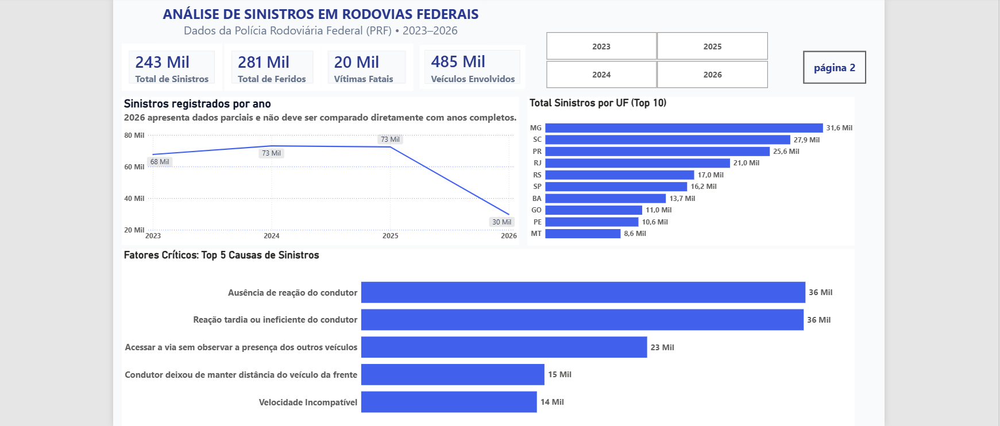
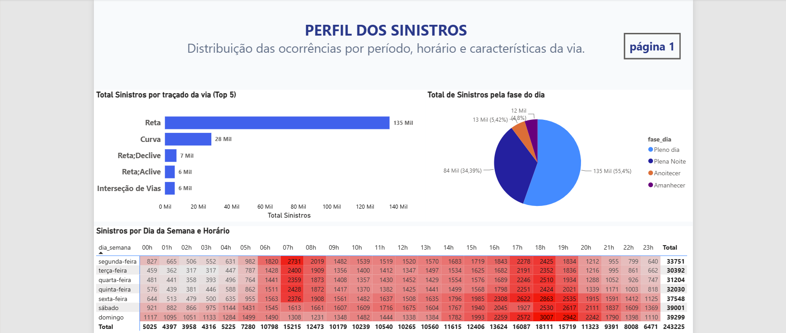

# 📊 Análise de Risco Logístico: Acidentes Rodoviários (PRF)

## 🎯 Objetivo do Projeto
Este projeto tem como objetivo realizar uma análise diagnóstica e preditiva baseada em dados da Polícia Rodoviária Federal (PRF). O foco foi identificar padrões críticos de sinistros em rodovias federais entre 2023 e 2026, transformando dados brutos em insights estratégicos para o planejamento logístico e redução de riscos operacionais.

---

## 🏗️ Estrutura do Projeto
Para garantir boas práticas de engenharia de dados, versionamento eficiente e conformidade com os limites do GitHub, a estrutura do projeto foi dividida da seguinte forma:

* `script_exploracao.ipynb`: Script principal em Python (Jupyter Notebook) focado na limpeza, tratamento e exploração inicial dos dados.
* `4_telaspowerbi/`: Pasta contendo os prints das telas do dashboard interativo desenvolvido para a tomada de decisão.
* `README.md`: Documentação técnica e apresentação do projeto.

> **Nota sobre os arquivos de dados:** As pastas de dados brutos (`1_dados_brutos/`), banco de dados (`2_banco_de_dados/`) e dados tratados (`3_dados_finais/`) **não foram enviadas para este repositório**. 
> 
> * **Por que não subi tudo?** Arquivos de dados em massa (como os `.csv` anuais da PRF e bases SQLite) possuem alta volumetria e pesam centenas de megabytes. Subi-los diretamente violaria os limites de tamanho do GitHub, gerando erros de conexão (*HTTP 408 Timeout*). Em projetos de portfólio de mercado, a melhor prática é versionar apenas a inteligência (código e visualizações) e disponibilizar os scripts para processamento sob demanda.

---

## 🛠️ Tecnologias e Ferramentas
* **Análise e Tratamento:** Python (Pandas, Jupyter Notebook).
* **Modelagem:** SQL (SQLite) para estruturação do banco de dados relacional.
* **Visualização:** Power BI para construção do dashboard executivo e medidas DAX.

---

## 📈 Dashboard Estratégico

### Visão Geral: Panorama de Sinistros
Concentra a volumetria, distribuição geográfica (Top UF) e a evolução temporal das ocorrências.
> 

### Visão Analítica: Comportamento e Fatores de Risco
Focada em granularidade temporal, cruzando dias da semana com horários de pico e causas raízes.
> 

---

## 💡 Principais Insights e Impacto de Negócio
1. **Sazonalidade e Janelas Críticas:** Identificação de horários e períodos do ano com maior concentração de sinistros, permitindo o redirecionamento de escalas logísticas preventivas.
2. **Mitigação de Riscos:** O cruzamento de variáveis comportamentais aponta a falta de reação como um dos principais gatilhos, servindo de base para campanhas de direção defensiva para frotas.
3. **Otimização Operacional:** Subsídio para que gestores de frotas e órgãos de trânsito planejem rotas alternativas e aloquem fiscalização de forma inteligente.

---
**Guilherme Oliveira Silva** | linkedin.com/in/guilhermeoliveiraslv | guilhermeoliveira2903@gmail.com
